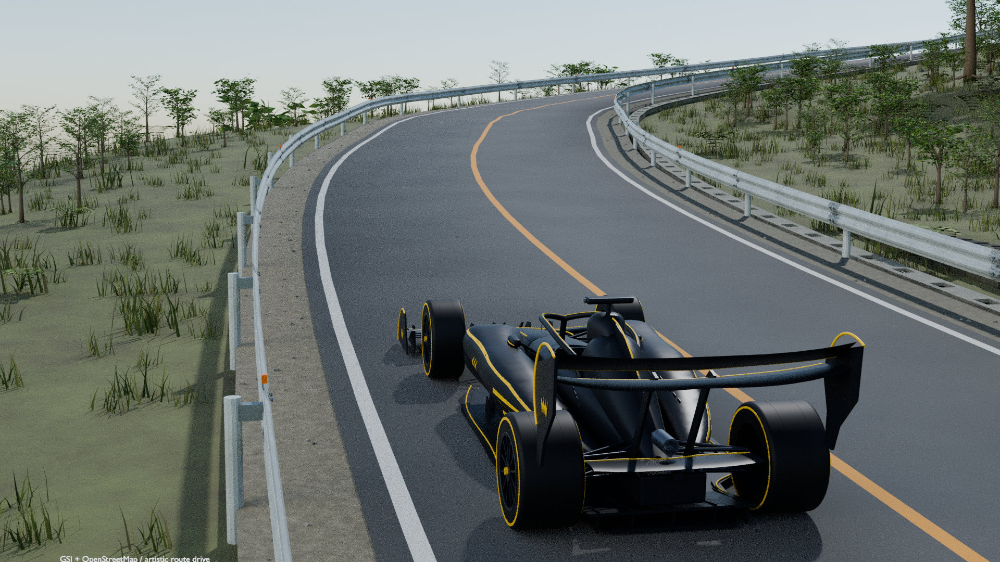
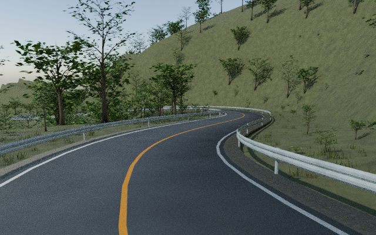
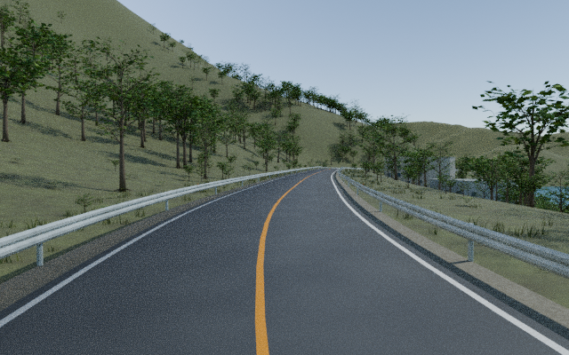
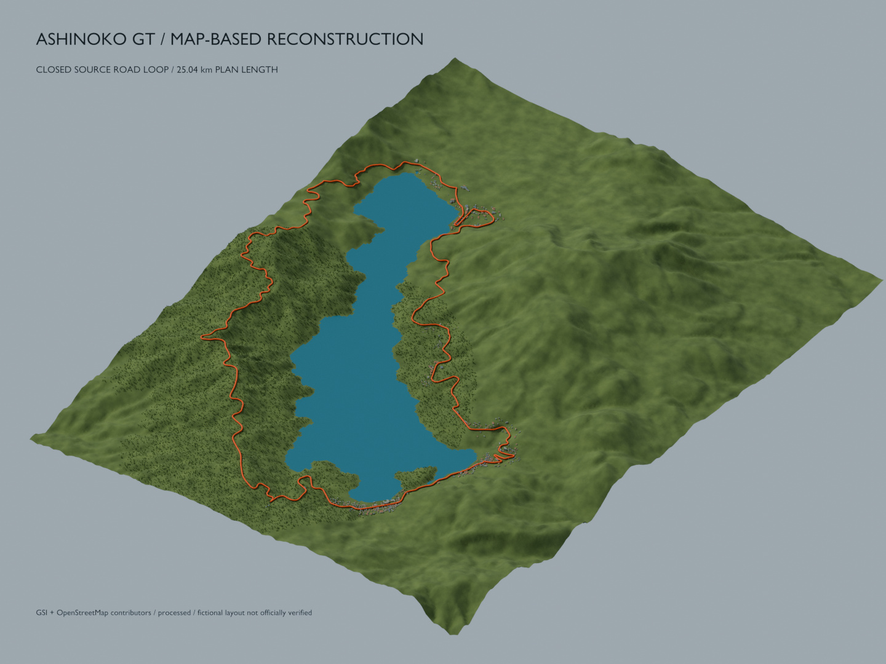

# 芦ノ湖 GT · KUROTORA DRIVE

[English](README.md) · [日本語](README.ja.md)

芦ノ湖周辺の地図・標高データから制作した約25.03 kmのコースを、KUROTORAで走る3Dブラウザゲームです。手動運転と自動走行に対応しています。

**[ゲームを開く](https://sunwood-ai-labs.github.io/ashinoko-kurotora-drive/)** · [検証・デプロイ状況](https://github.com/Sunwood-ai-labs/ashinoko-kurotora-drive/actions/workflows/pages.yml) · [既知の制約と検証状況](docs/VERIFICATION.md)



*Blender制作モデルの1080p試写です。ゲーム実機スクリーンショットではありません。西側区間の制作プレビューで、低サンプルのためノイズが残っています。ブラウザ版では描画・材質・LODが異なります。*

## 🏞️ 8つの視点で見るコース

湖を見渡す全景から、ガードレールのボルトまで。表紙を含む8枚で、景色・起伏・沿道の作り込みを紹介します。

すべて実際のBlender制作モデルのレンダーです。ゲーム実機スクリーンショットではありません。地形ベース・v3詳細区間・v4全周確認を各キャプションで区別しています。元の解像度を保ち、大きい画像は配信用JPEGにしています。[画像の出典と撮影メモ](docs/GALLERY.md)。


**湖と山並みを一望**<br>水面、湖を囲む稜線、斜面を縫う道。コースの舞台を広い視点で。<br><sub>地形ベース制作段階の全景</sub>

| | |
|:---|:---|
|  |  |
| **森へ登るS字カーブ**<br>外側から見て分かる道路の曲線、登り勾配、森の境界。<br><sub>v3・西側詳細区間</sub> | **路肩まで作り込む**<br>波形ガードレールのボルト、側溝、石積み、足元の草を近くから。<br><sub>v3・西側詳細区間</sub> |

| | |
|:---|:---|
|  |  |
| **木々に沿うカーブ**<br>低い視点で、山肌を回り込む路面とガードレールの流れを見る。<br><sub>v4・6 km地点の確認視点</sub> | **木立の先に湖**<br>道の先が開け、木々の間に青い水面が見える区間。<br><sub>v4・12 km地点の確認視点</sub> |

| | |
|:---|:---|
|  |  |
| **建物のある坂道へ**<br>窓のある建物と上り坂が現れ、山間の道から景色が切り替わる。<br><sub>v4・21 km地点の確認視点</sub> | **一周の形をつかむ**<br>湖・地形・閉ループの関係を、強調したルート線で見渡す。<br><sub>地形ベースの旧25.04 km計画図・現ルートは25.03 km</sub> |

標高：国土地理院。地図由来の形状：© OpenStreetMap contributors。芸術的な再構成です。[出典・権利の詳細](docs/DATA.md)。

## 🎮 まず遊ぶ

WebGL 2が使えるブラウザで開き、読み込み後に「手動で走る」または「自動走行で出発」を選びます。アカウント登録・OpenAI認証は不要です。

- **W / ↑**：アクセル
- **S / ↓ / Space**：ブレーキ
- **A / D または ← / →**：ステアリング
- **R**：現在位置付近の路面中央へ復帰
- **P**：一時停止・再開
- **M / 自動走行ボタン**：自動と手動を切り替え
- タッチ端末：画面のハンドルとペダルで操作。操舵とペダルを同時に押せます

手動入力を入れると自動走行は解除されます。別タブへ移ると一時停止し、戻ったら「再開」で続けられます。1周で終了します。

**初回の配布データは約110 MB（圧縮転送前）です。** 回線や端末によって読み込みに時間がかかります。モバイル通信量に注意してください。WebGLを開始できない場合は画面に原因と確認方法が表示されます。保護機能を無効にする必要はありません。

## 🚀 開発環境で起動

Node.js 22以上とPython 3を使用します。ゲームとテストの外部npm依存はなく、Three.jsとMeshoptimizerはライセンス付きで同梱しています。

```sh
git clone https://github.com/Sunwood-ai-labs/ashinoko-kurotora-drive.git
cd ashinoko-kurotora-drive
npm test
npm start
```

[http://localhost:8000](http://localhost:8000) を開きます。`file://`で直接開かず、HTTPサーバーを使ってください。`python3`がない環境では `python -m http.server 8000 --directory dist` でも起動できます。

## 📦 ゲームとコースのリポジトリ

ゲームとコースは別々のリポジトリで管理します。

- ゲーム正本：[ashinoko-kurotora-drive](https://github.com/Sunwood-ai-labs/ashinoko-kurotora-drive)、ゲーム版0.3.0。操作・車体・描画・物理を管理
- コース正本：[ashinoko-course-data](https://github.com/Sunwood-ai-labs/ashinoko-course-data)、パック4.0.0・schema 1。路面・地形・植生・座標契約・出典を管理

ゲームには `course.lock.json` で32ファイルすべてのSHA-256を固定したコースのコピーを同梱します。コース側の変更だけで公開ゲームは変わりません。clone後のローカル起動には外部CDNやコースサーバーが不要です。既存のゲームURLは変えていません。

同一の固定版を取り直す場合は `npm run course:import -- --source ../ashinoko-course-data`。新しい版の取り込みはレビュー後に `--accept-update` を付け、`npm run checksums` と `npm test` を実行します。詳細は更新手順にあります。

- [構成と責務](docs/ARCHITECTURE.md)
- [データの出典・権利・精度](docs/DATA.md)
- [更新・テスト・配信・ロールバック](docs/MAINTENANCE.md)
- [変更を提案する](CONTRIBUTING.md)
- [安全性について](SECURITY.md)
- [Sunwoodスキル適用と整備記録](docs/REPOSITORY_POLISH.md)

配布ファイルはそのまま実行できるソースとデータです。原Blender制作ファイルを含む完全な制作環境は、このリポジトリには含みません。再生成できる範囲と必要な入力は更新手順に記載しています。

## ✅ 検証の範囲

CIでは配布ファイルのSHA-256、JavaScript構文、コースデータ、基本的な走行挙動、自動走行の完走を検査します。CI成功はブラウザ上の見た目やFPSを保証しません。

公開URLと認証不要の到達を確認済みです。検証に使用したクラウドChromiumではWebGLが無効で、3D描画・実操作・実機性能の受入検証は未完了です。確認済み項目と残る項目は[検証記録](docs/VERIFICATION.md)で区別しています。

## 📄 出典・ライセンス

道路・湖岸・建物の基礎データは © [OpenStreetMap contributors](https://www.openstreetmap.org/copyright)、標高は[国土地理院](https://www.gsi.go.jp/kikakuchousei/kikakuchousei40182.html)に基づきます。ゲーム用に平滑化・補完した芸術的な再構成で、測量成果そのものや実道路の安全情報ではありません。

Three.jsとMeshoptimizerはMITです。原コード、KUROTORA、その他の制作資産に一律のオープンソースライセンスは付与していません。公開と第三者への再利用許諾は区別しています。[権利範囲](LICENSE.md)と[詳しい出典](docs/DATA.md)を確認してください。
