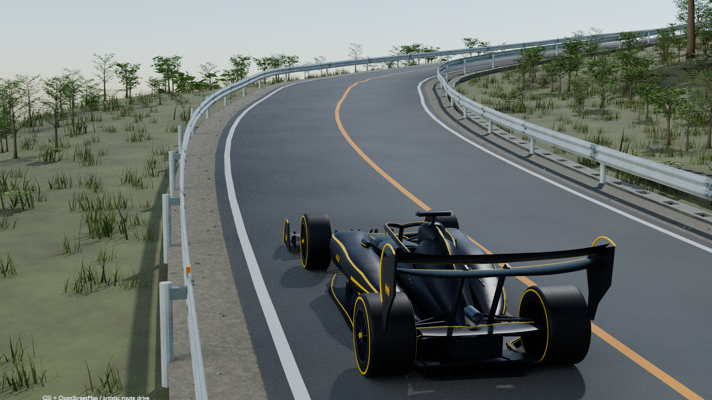

# Ashinoko GT · KUROTORA DRIVE

[English](README.md) · [日本語](README.ja.md)

A single-player 3D browser driving prototype on an approximately 25.03 km course reconstructed from map and elevation data around Lake Ashi. Drive the KUROTORA manually or use automatic driving.

**[Play the game](https://sunwood-ai-labs.github.io/ashinoko-kurotora-drive/)** · [CI and deployment](https://github.com/Sunwood-ai-labs/ashinoko-kurotora-drive/actions/workflows/pages.yml) · [Verification limits](docs/VERIFICATION.md)



*1080p Blender production preview, not a screenshot of the running browser game. It shows a western production sector with low-sample noise. Browser rendering, materials and level of detail differ.*

## 🎮 Play

Open the game in a browser with WebGL 2, wait for loading, and select manual or automatic driving. No account or OpenAI authentication is required.

- W / Up: accelerate
- S / Down / Space: brake
- A / D or Left / Right: steer
- R: recover near the current road position
- P: pause or resume
- M / automatic-driving button: switch driving modes
- Touch: hold steering and pedals together using the screen controls

Manual input cancels automatic driving. Switching tabs pauses the game; use Resume after returning. The session ends after one lap.

The initial distribution is approximately 110 MB before transfer compression. Loading and mobile-data cost depend on the connection and device. WebGL initialization failures show a readable recovery explanation; disabling browser protections is not required.

## 🚀 Run locally

Use Node.js 22+ and Python 3. Runtime and tests require no npm downloads. Three.js and Meshoptimizer are bundled with their license notices.

```sh
git clone https://github.com/Sunwood-ai-labs/ashinoko-kurotora-drive.git
cd ashinoko-kurotora-drive
npm test
npm start
```

Open [http://localhost:8000](http://localhost:8000). Use an HTTP server rather than opening `file://` directly. If your system names Python `python`, use `python -m http.server 8000 --directory dist`.

## 📦 Game and course repositories

- Game source: [ashinoko-kurotora-drive](https://github.com/Sunwood-ai-labs/ashinoko-kurotora-drive), game 0.3.0. Owns controls, vehicle, rendering and physics
- Course source: [ashinoko-course-data](https://github.com/Sunwood-ai-labs/ashinoko-course-data), pack 4.0.0 / schema 1. Owns route, scenery, vegetation, data contract and provenance

The game vendors 32 course files pinned by SHA-256 in `course.lock.json`. A course-repository update never silently changes the live game. After cloning, local serving needs no external CDN or course server. The existing game URL is preserved.

Restore the pinned pack with `npm run course:import -- --source ../ashinoko-course-data`. To deliberately accept a reviewed new release, add `--accept-update`, then run `npm run checksums` and `npm test`. See the maintenance guide for details.

- [Architecture and responsibilities](docs/ARCHITECTURE.md)
- [Sources, rights and precision](docs/DATA.md)
- [Updates, testing, publishing and rollback](docs/MAINTENANCE.md)
- [Contributing](CONTRIBUTING.md)
- [Security](SECURITY.md)
- [Sunwood skill application and maintenance record](docs/REPOSITORY_POLISH.md)

The detailed guides above are in Japanese. Distribution files are executable source and data. Original Blender files and the complete production environment are not included.

## ✅ Verification

CI checks complete distribution SHA-256 coverage, JavaScript syntax, course data, pinned imports, basic driving behavior and a simulated automatic lap. CI success does not prove browser appearance or frame rate.

The public URL was reached without authentication. The cloud Chromium used for validation cannot create WebGL 2, including with normal acceleration enabled. Actual 3D rendering, playable input flows and hardware performance remain unverified. [Verification notes](docs/VERIFICATION.md) separate observed checks from remaining acceptance work.

## 📄 Sources and rights

Road, lake and building bases derive from © [OpenStreetMap contributors](https://www.openstreetmap.org/copyright); terrain/elevation derives from the [Geospatial Information Authority of Japan](https://www.gsi.go.jp/kikakuchousei/kikakuchousei40182.html). This smoothed artistic reconstruction is not a survey or real-road safety dataset.

Three.js and Meshoptimizer are MIT-licensed. No blanket open-source license is granted for original code, KUROTORA or other original assets. Public availability is distinct from unrestricted reuse. Read [LICENSE.md](LICENSE.md) and the [data guide](docs/DATA.md).
